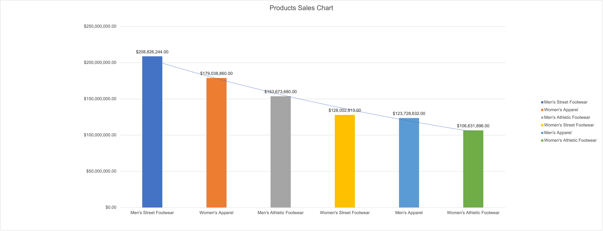
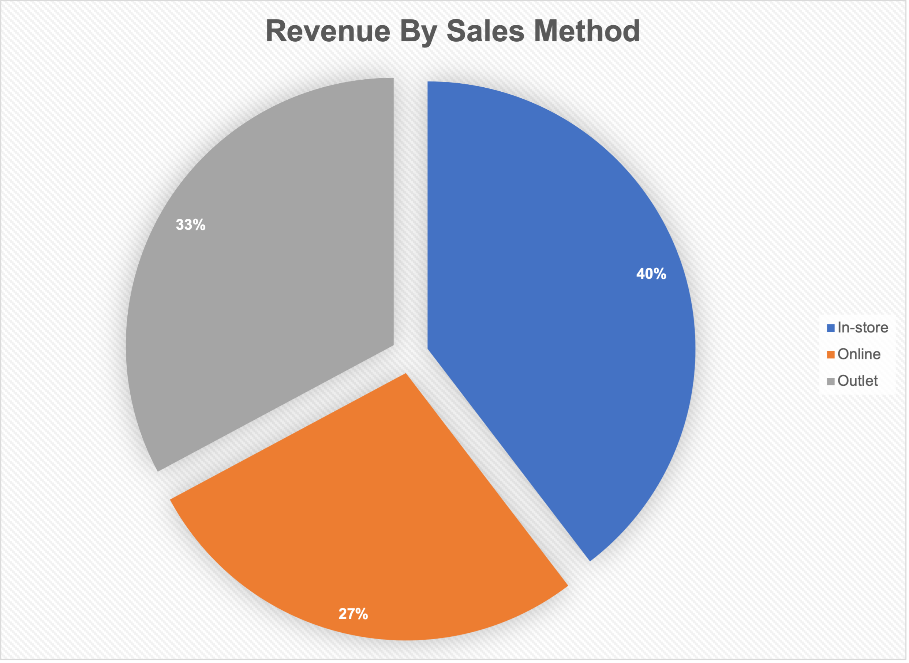
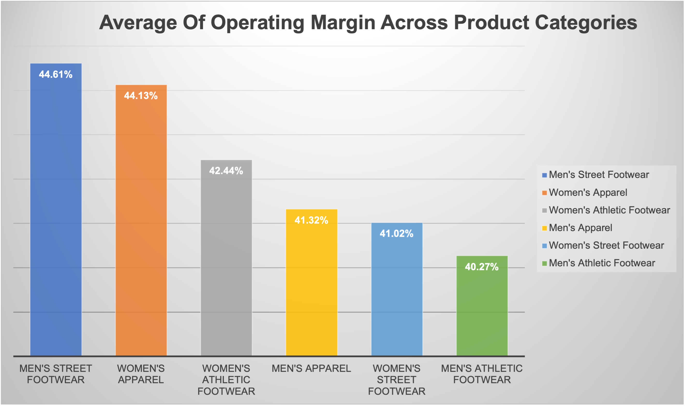
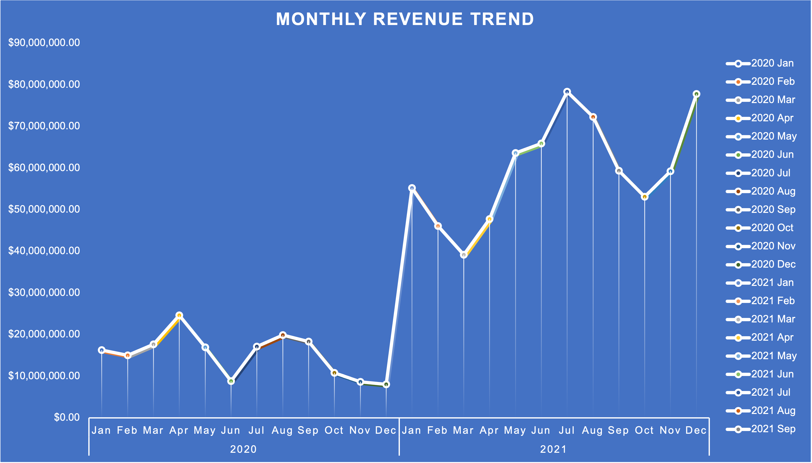
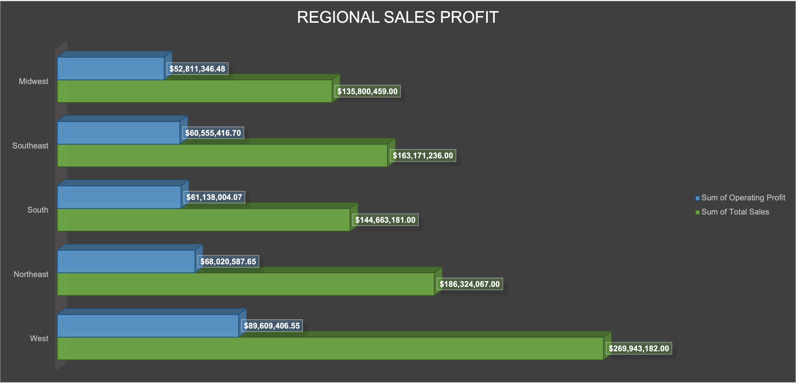
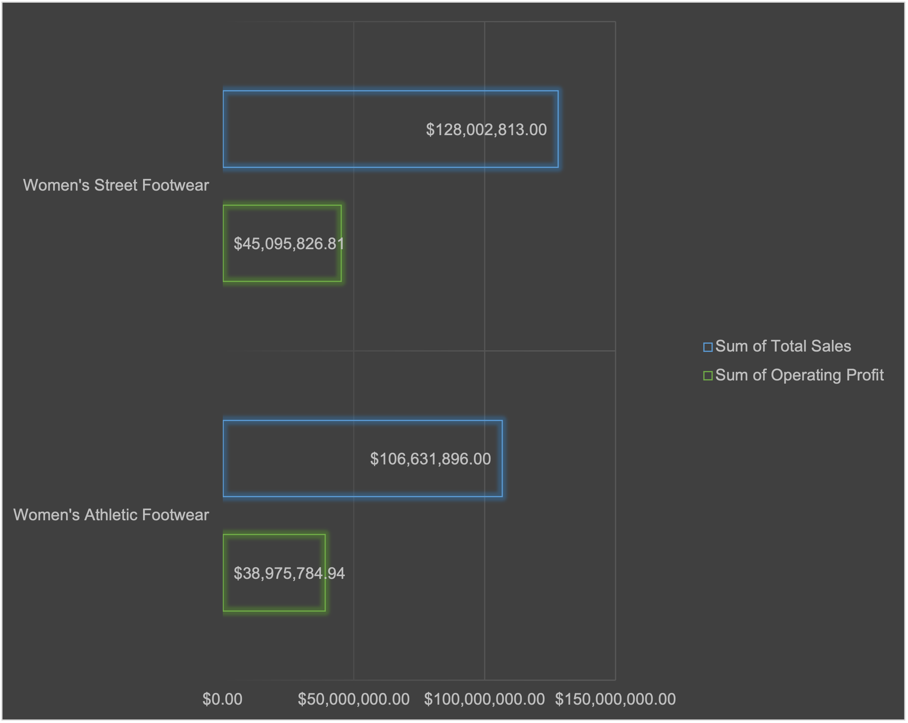
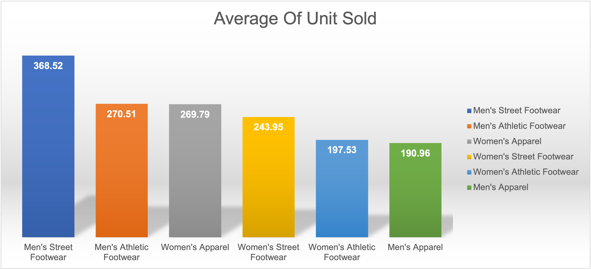

# Adidas Sales Analysis

## Overview
This project analyzes Adidas sales data to uncover insights on revenue, profitability, sales channels, regional trends, and product-level performance. The goal is to translate raw sales data into actionable business insights for strategic and operational decision-making.

## Tools Used
- Microsoft Excel (Pivot Tables, Calculated Fields, Charts)

## Business Questions
- Which product categories generate the most revenue?
- How do in-store and outlet sales compare?
- Which products and categories generate the highest profit?
- How do sales trends change over time?
- What insights can be drawn from sales velocity and inventory turnover?

## Key Insights
Detailed analysis and insights for all 12 key questions can be found in [insights.md](insights.md).

## Key Visuals

### 1. Total Revenue by Product Category

### 2. In-store vs Outlet Sales Performance

### 3. Average Operating Margin by Category

### 4. Revenue Trends Over Time

### 5. Regional Contribution to Sales vs Profit

### 6. Women’s Footwear Segment Comparison

### 7. Average Units Sold per Day by Category

---

## Repository Contents
- `insights.md` – Full 12-question business insights  
- `analysis.xlsx` – Excel file containing raw data, pivot tables, and charts  
- `charts/` – Folder containing all exported visualizations
