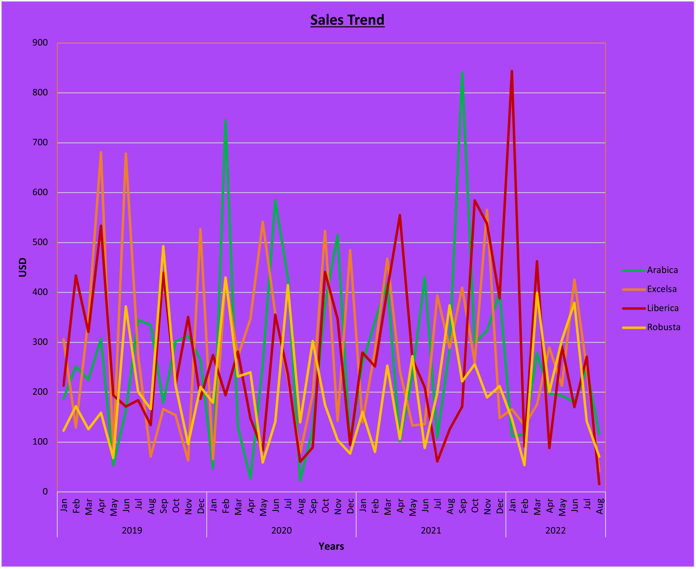
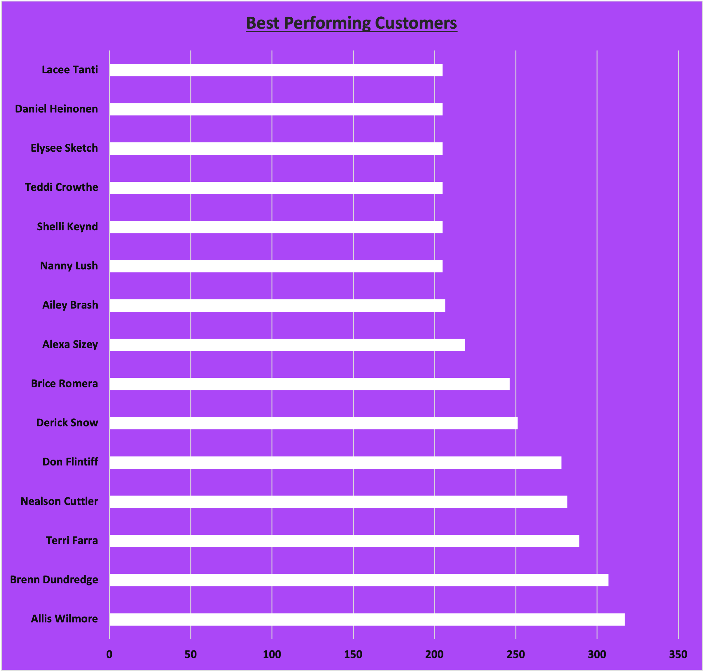

# ☕ Coffee Sales Performance Analysis

## 📌 Project Overview

This project analyzes transactional coffee sales data to evaluate revenue performance, product contribution, customer value, and geographic distribution.

The objective is to generate actionable insights to support strategic sales and marketing decisions.

---

# 📊 Key Business Metrics

- **Total Revenue:** $45,134.26  
- **Total Orders:** 957  
- **Total Customers:** 913  
- **Dataset Size:** 1,000 transaction records  

---

# 📈 Revenue by Coffee Type

### Insight

Excelsa generated the highest revenue at **$12,306.44**, followed closely by Liberica and Arabica.

Robusta recorded the lowest total revenue contribution.

**Business Implication:**  
Revenue distribution is relatively balanced across three major product lines, reducing product concentration risk.

---

# 🌍 Revenue by Country

### Insight

- **United States:** $35,638.89 (≈ 79% of total revenue)  
- Ireland: $6,696.87  
- United Kingdom: $2,798.51  

**Business Implication:**  
The company is heavily dependent on the U.S. market. Geographic diversification presents a growth opportunity.

---

# 👑 Top 5 Customers by Revenue

| Customer | Revenue ($) |
|-----------|-------------|
| Allis Wilmore | 317.07 |
| Brenn Dundredge | 307.05 |
| Terri Farra | 289.11 |
| Nealson Cuttler | 281.68 |
| Don Flintiff | 278.01 |

### Insight

Revenue contribution is moderately distributed, indicating no extreme over-reliance on a single customer.

This reduces customer concentration risk.

---

# 📦 Sales Distribution Analysis

The dataset reveals:

- 913 unique customers generating 957 orders  
- Low repeat order frequency per customer  
- Revenue spread across multiple product categories  

**Strategic Observation:**  
Customer acquisition is strong, but retention strategy could significantly increase lifetime value.

---

# 💡 Strategic Recommendations

### 1️⃣ Geographic Expansion Strategy
With 79% of revenue coming from the United States, targeted marketing efforts in Ireland and the United Kingdom could balance revenue streams.

### 2️⃣ Product Positioning
Excelsa, Liberica, and Arabica show similar revenue performance.  
A premium positioning strategy could increase average order value.

### 3️⃣ Customer Retention Optimization
Given the close ratio of customers to orders (913 customers / 957 orders), introducing loyalty incentives may increase repeat purchases.

### 4️⃣ Market Risk Management
Diversifying geographic exposure will reduce overdependence on a single country.

---

# 🛠 Tools Used

- Microsoft Excel (Data Structuring)
- Python (Pandas for Data Analysis)
- Matplotlib (Visualization)
- GitHub (Documentation & Version Control)

---

# 📌 Conclusion

The analysis highlights strong product performance balance but heavy geographic revenue concentration.

By implementing geographic expansion and customer retention strategies, the business can drive sustainable long-term growth while mitigating concentration risk.
