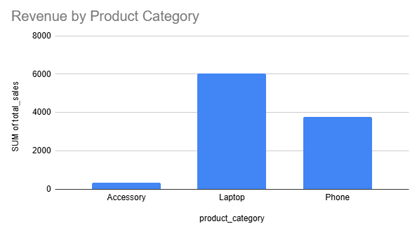
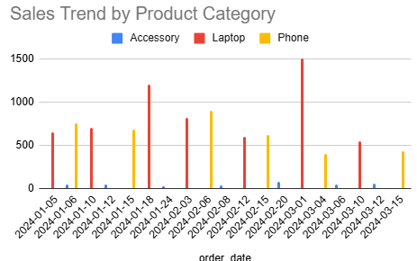
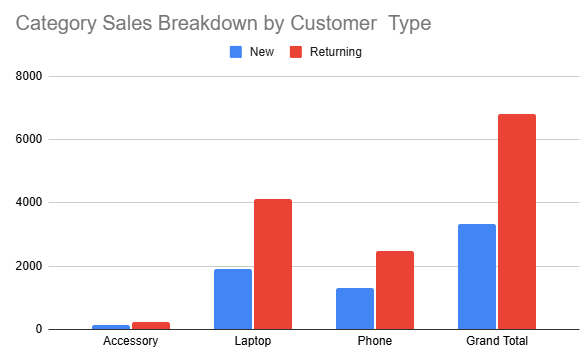
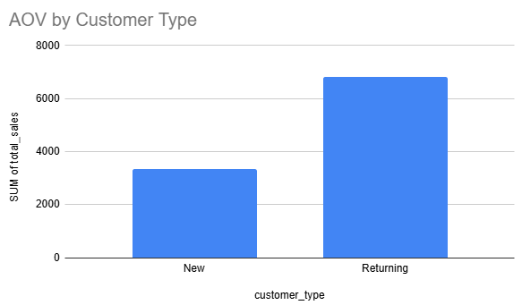

# Customer Pattern Analysis

## Overview
This project analyzes sales data for an electronics store to understand product performance and customer behavior using pivot tables and charts. It highlights revenue trends, product popularity, and customer purchase patterns.

## Dataset
- Transaction-level sales data
- Product categories
- Customer types
- Order dates and revenue

## Analysis Performed
- Revenue by product category
- Sales trend over time
- Customer type vs product category
- Average Order Value (AOV) by customer type

## Key Insights
- Laptops generate the highest revenue.  
- Accessories underperform compared to main devices.  
- Returning customers spend more on core products.  
- Customer type strongly influences product preferences.

## Visualizations

### Revenue by Product Category

### Sales Trend Over Time

### Product Category Sales Breakdown

### Average Order Value by Customer Type

## Tools Used
- Google Sheets / Excel  
- Pivot Tables  
- Charts
